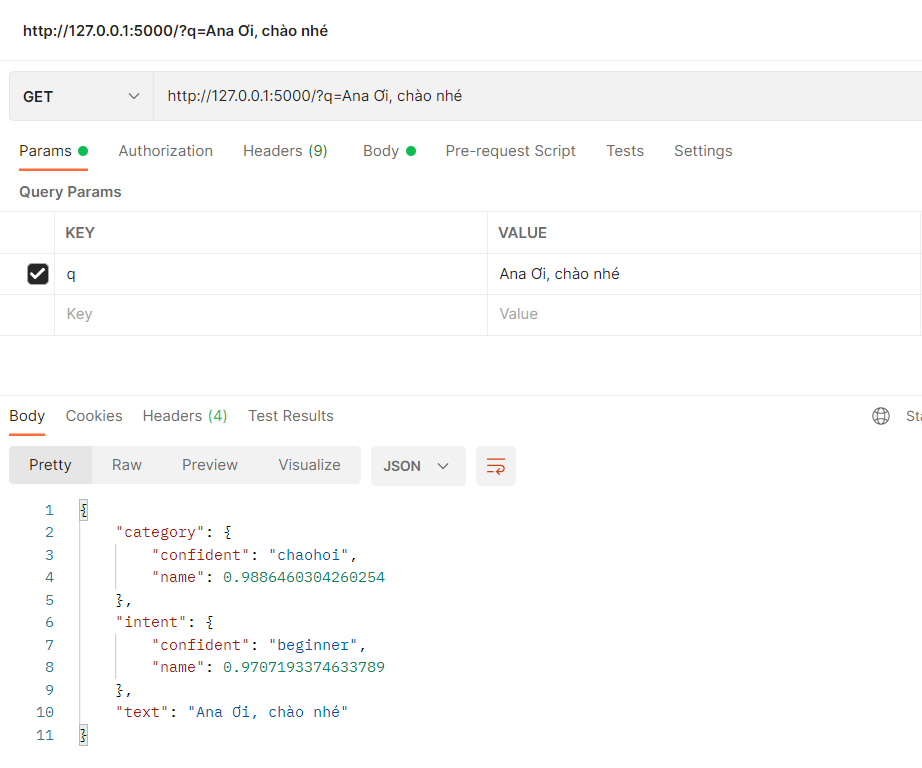

## Phân loại đa nhãn intent và category bằng học sâu
- Tải cái package với requirements.txt
- train mô hình 
- run service
- test kết quả


<div align="center">    
 
# Category Web Service   


</div>

Các file model và file data sẽ được lưu trong thư mục `file data` 

Do đó, sẽ cần đưa file vào, service mới hoạt động được.

Có thể chỉnh sửa một vài thông tin trong file `config.py` nếu cần
```python
# Tên file data, là dữ liệu chatbot đã được xuất ra dạng csv
DATA_FILE = "file_store/data.csv"

# Tên file chứa danh sách intent, category ở dạng nhị phân
# phải chùng thư viên pickle của python để đọc
INTENT_FILE = "file_store/intents_list.pkl"
CATEGORY_FILE = "file_store/categories_list.pkl"

# Tên backbone của model, phần phụ trách quá trình nhúng văn bản
BACKBONE_NAME = "VoVanPhuc/sup-SimCSE-VietNamese-phobert-base"

# Tên finetune model, là hai tầng fully connected layer
MODEL_FILE = "file_store/fc.pt"

MAX_LENGTH = 45 # Có thể coi như sô từ tối đa model có thể hiểu
```
## install env pip 
Cài đặt các package đã dùng trong lúc làm 
```bash
$ pip install -r requirements.txt
```

## Train model 
Train model sử dụng pytorch-lightning

Kết thúc quá trình train, ta sẽ được file `fc.pt` ở thư mục `file_store`

Các tham sô trong quá trình train có thể được chỉnh sửa trong file `config.py`
```python
BATCH_SIZE = 32 # Kích thước từng batch trong data
EPOCH = 100 # Số vòng train
LR = 8e-4 # Tốc độ học hập
EPS = 1e-8 # Hệ số giảm LR
```
```
$ python train.py
```

## Run service 
Khởi chạy service, đường dẫn mặc định sẽ là http://127.0.0.1:5000/

Một API đơn giản của service này là http://127.0.0.1:5000/?q=<TEXT>

API cần đầu vào là text, trả về độ tin cậy intent, category dạng chuỗi json
```
$ python main.py
```

## Test request service
Test một request
```` 
$ python test.py
````
http://127.0.0.1:5000/?q=Xin Chào

